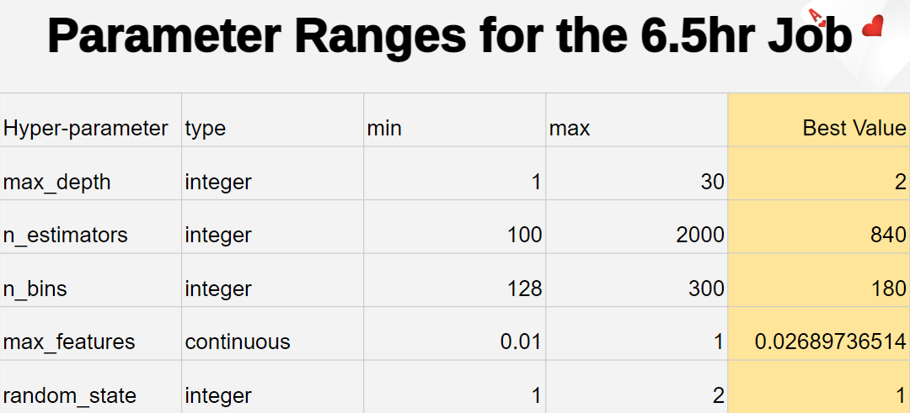
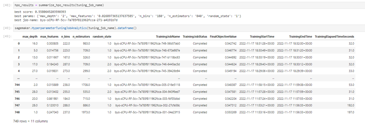
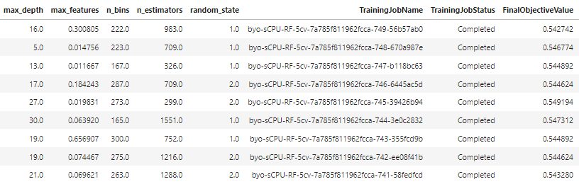

# MLB Hyper-optimized Micro-betting dApp

The worldwide sports betting market is at a whopping $3 trillion. Behind the NFL, college football, and the NBA, MLB and the NHL make up the second largest market for sports betting at $80 Billion. Although there are many companies in the cryptocurrency sports betting arena, the area of micro-betting-- the act of betting on real-time small, repetitive but key actions of players in the game-- has not been explored yet. We are looking to create an application that will allow bettors to bet on Justin Verlander's pitches, pitch by pitch. In order to maximize profit, the initial betting odds would be determined by our in-house, hyper-optimized machine-learning models. This repo is just a POC/MVP, so if this project were to take off, we'd expand the betting to pitchers other than Justin Verlander, among other things.

A link to view our presentation can be found [here](https://docs.google.com/presentation/d/1MGC5Rp2M2ozGc297LVacbyGyKW8kyhvc5PDpWsmPRwA/edit?usp=sharing) . This was a project we did for BootCampSpot, a 2U program through Rice University.
---

## Technologies 

This application was written in Python. For the backend, blockchain application, the program used the Web3 and BIP libraries. Ganache was used as a local test network that had Ethereum wallets we can interact with. For the frontend, we used Streamlit. Please refer to the following:

* [Ganache](https://trufflesuite.com/ganache/)
* [Web3](https://web3py.readthedocs.io/en/v5/)
* [BIP](https://pypi.org/project/bip-utils/)
* [Streamlit](https://streamlit.io)

For the random forest hyper-optimization, refer to the following tutorial
* [Rapids](https://www.youtube.com/watch?v=BtE4d0v6Css&t=1270s&ab_channel=RAPIDSAI)

For the neural-network hyper-optimization part of the program, we used the following libraries: 
* [Pandas](https://github.com/pandas-dev/pandas)
* [Numpy](https://github.com/numpy/numpy)
* [Scikit-Learn](https://scikit-learn.org/stable/)
* [TensorFlow](https://www.tensorflow.org/api_docs)

---

## Installation Guide

Before running the above libraries, you will need to install them first. Please refer to the following install prompts in terminal as needed:


`pip install pandas`

`pip install numpy`

`pip install tensorflow`

`pip install -U scikit-learn`

`npm install web3`

`pip install streamlit`

`pip install bip_utils`

`pip install scikit-optimize`

In order to install Ganache, please follow the hyperlink under the *Technologies* section.

To perform the random-forest hyper-optimization (HPO), please follow the [hyperlink](https://www.youtube.com/watch?v=BtE4d0v6Css&t=1270s&ab_channel=RAPIDSAI) under the *Technologies* section. 

If you just want to run our HPO code, delete the following default files and replace them with the ones in this repo: "HPODatasets.py" & "rapids_sagemaker_hpo.ipynb" .
You'll also need to make a bucket and upload the "hpo2_verlander_data.csv" file. Then you'll have to update the 5th and 6th cells in the "rapids_sagemaker_hpo.ipynb" accordingly, since you cannot create a bucket with the same name. Beware that if you run all the cells in "rapids_sagemaker_hpo.ipynb", you'll kick off a 6.5 hour calculation that costs about ~$6. Your results may not be the exact same because the random-state of the train-test split may not have been specified under-the-hood.

---

## Libraries 

This application includes many aspects of Web3 and BIP libraries. Please refer to the imports below for the functions we wrote for this application:

```python
# Imports
import os
import requests
from dotenv import load_dotenv
load_dotenv()
from bip44 import Wallet
from web3 import Account
from web3 import middleware
from web3.gas_strategies.time_based import medium_gas_price_strategy
from web3 import Web3
```

Additionally, for the Streamlit application itself, refer to the imports below: 

```python 
# Imports
import os
import json
from web3 import Web3, Account
from pathlib import Path
from dotenv import load_dotenv
import streamlit as st
import project2 as p2
import pandas as pd

# Import the functions from ethereum.py
from ethereum import generate_account_sender, get_balance, send_transaction
```

For the random-forest hyper-optimization, refer to the imports below:

```python
import sagemaker
from helper_functions import *
import pandas as pd
```

For the neural-network hyper-optimization, refer to the imports below:

```python
# Imports
import seaborn as sns
import tensorflow as tf
from tensorflow import keras
from tensorflow.keras import backend as K
from tensorflow.keras.layers import InputLayer, Input
from tensorflow.keras.callbacks import TensorBoard
from tensorflow.keras.optimizers import Adam
from tensorflow.keras.models import load_model
from tensorflow.keras.callbacks import EarlyStopping

import skopt
from skopt import gp_minimize
from skopt.space import Real, Categorical, Integer
from skopt.utils import use_named_args
```
---

## Database

All the data used was sourced and downloaded from [Baseball Savant](https://baseballsavant.mlb.com). Thank you to Baseball Savant for providing reliable, accurate player, team, and game statistics after each game. 

With that being said, the Justin Verlander dataset used is found in the resources folder, including the September 29th game data: 

* verlander_update.csv
* field_test_data.csv

---

## Usage 

Our application utilizes the Streamlit library as a frontend where users and bettors can interact with. In order to use the final versions of our application, please refer to the *testing* folder, and run the following command:

`streamlit run streamlit.py`

Please ensure that our application is connected with your Ganache server with the appropriate RPC server and account addresses. 

---

## Results

### Noah's Hyper-optimized Random Forest:
For context, this micro-betting-app project is our 2nd project on this pitching topic. Our 1st project consisted of us making several different machine-learning models to try and predict Verlander's next pitch. Noah's model ended up being the best, being 59% accurate. Though, as we found out in this project, 59% accurate is misleading because it is the model's accuracy from only 1 train-test split. For that particular split, the model seemed to have gotten lucky. This became apparent when Noah updated the pitching data, and the model's accuracy instantly dropped to ~53-54%.

As preparation for the HPO, Noah got rid of a bunch of features that had very little importance on the outcome of the next pitch. Ultimately, he reduced the number of features from 55 to 38, significantly reducing the compute time for the HPO. And the ~53-54% accuracy was retained even with this reduction in features. Then, to reduce the chance of a lucky model, Noah initiated 5 train-test splits. The HPO job was trained to maximize the *average* accuracy of a given model acrost all 5 of those splits.

The HPO job was computed on AWS's cloud servers. The HPO used the Bayesian method, which is one of the best HPO techniques. The HPO job ran for 6 & a half hours, during which 749 models were tested (750 is the maximum allowed with the particular setup used). Each model had a different combination of hyper-paramters. The following image shows the tested ranges of those hyper-parameters:



The best model of those 749 had an accuracy of ~55.81%, which is an improvement of about 1-2% over the previous, non-hyper-optimized model. This was our best model for this project. For context, a naive guess of a fastball everytime would garner about 48% accuracy. So, this model is about ~7-8% more accurate than a naive guess. For comparison some other people with fancy degrees have been able to achieve 10 or 15% accuracy above a naive guess when predicting pitches. The highest %accuracy we've seen someone else achieve when predicting pitches was 67%. So basically, our model is pretty good, but it's not the best in world. Here is a screenshot of the results:



To truly find the best model, more than 750 models may need to be tested because the last few training jobs were still making very exploratory (rather than exploitative) guesses as shown below (exploitative guesses are guesses that are nearby really good guesses to see if an even better model is nearby):



### Alessandro's Hyper-optimized Neural Network:
After running both tests on new data the models had never seen, we can see that the hyper-optimized neural-network model increased its accuracy score by 4%. It may not be such a high increase, but it shows that the hyper-optimized neural network could predict better than the default model. However, this model still needs a lot of optimization and work, especially since it isn't consistent with the outputs. This issue is likely caused to not having powerful software such as AWS due to it being run on a local drive or not finding the best parameters for the model. We can also notice that the precision section of both results seems skewed, which may be due to insufficient data (with only ~100 support in the test data-set-- however this wasn't an issue for Noah's data, which had ~750 support, so this could be a train-test split issue. The dataset had 2500 pitches in all). The model's data may need to be scaled and/or more data inputted for the precision to be outputted accurately. With more time on researching documentation for hyper-optimizing neural network on a software system rather than locally, we could produce a model that may have an accuracy score higher than the hyper-optimized model used here.


--- 

## Contributors

[Brittanie Polasek](https://www.linkedin.com/in/brittanie-polasek/), [Rishi Prasadha](https://www.linkedin.com/in/rishi-prasadha-912212133/), [Noah Saleh](https://www.linkedin.com/in/noah-saleh-5b7255240/) (noahgsaleh@gmail.com), [Jake Wheeler](https://www.linkedin.com/in/jake-wheeler-81817337/), [Alessandro Valentini](https://www.linkedin.com/in/alex-valentini-29539a1a9/)

---

## License

MIT
